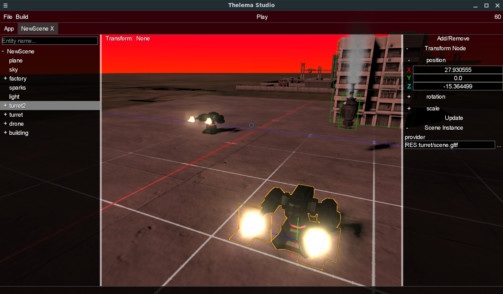

### Thelema Engine

**Thelema** is Kotlin Multiplatform 3D graphics engine. It was based on libGDX sources and completely redesigned.

#### Features
* Entities and components to work with scenes
* Shaders
  * Shader nodes (shader graph)
  * Deferred shading
  * Physicaly based rendering (PBR)
  * Bloom, Emissive materials
  * SSAO
  * Cascaded shadow mapping, Soft shadows
  * Motion blur
  * IBL
* 3D graphics
  * VBO, VAO, UBO, Instancing buffers
  * Skinned meshes
  * Particle system
  * Lights: directional, point
  * glTF 2.0 loading
* Audio
  * Ogg/Vorbis loading
  * WAV loading
  * Procedural sound generation
* JSON
* Image loading from JPG, PNG, TGA, BMP, PSD, GIF, HDR, PIC
* ODE physics
* Platforms: Desktop JVM, Kotlin/Native, Kotlin/JS, Android

Thelema Studio - 3D Editor

#### Work in progress
* GUI (redesign)
* 3D Audio API (redesign)
* Navigation mesh
* Vulkan API
* Terrain rendering
